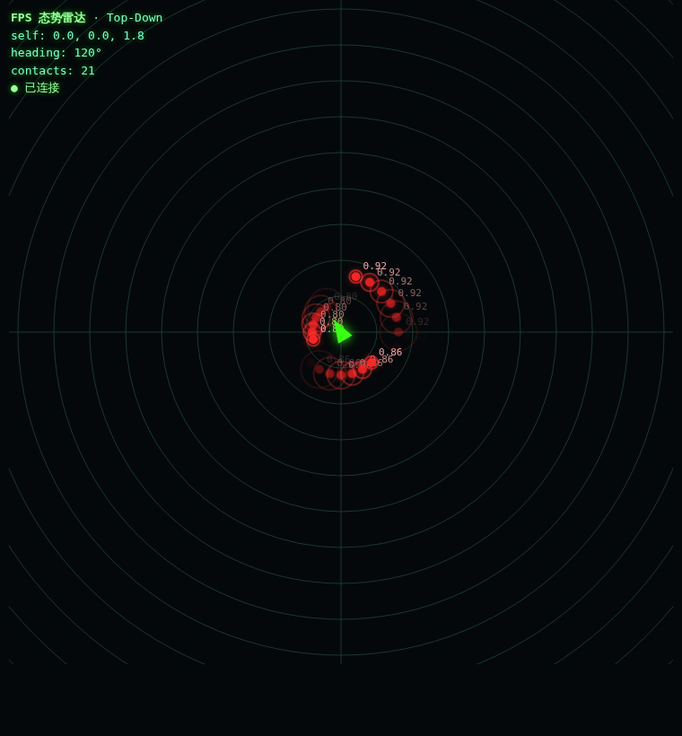
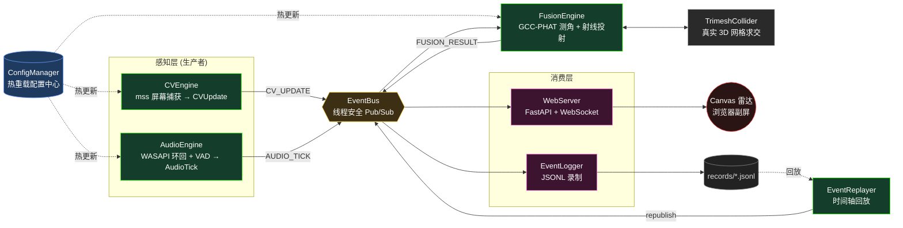

# 🎯 FPS 多模态态势感知系统 (Multimodal Situational Awareness)

> **物理隔离 · 多模态融合 · 全景可追溯**
> 一套工业级的实时态势感知框架：融合**实时音频提取**、**CV 视觉定位**与**真实 3D 网格碰撞约束**，
> 在绝对世界坐标系下解算并可视化目标方位。严格遵循高内聚、低耦合的模块化设计。

---

## 1. 项目愿景

在不侵入目标进程的前提下（**物理隔离**：屏幕环回采集音频 + 屏幕捕获视觉），
将两路异步、异频的感知信号在**时间轴**上缝合、在**世界坐标系**下做空间收敛，
最终把"敌人在哪"以低延迟雷达的形式呈现给玩家副屏。

整个系统由一条解耦的事件总线串联，任意模块均可独立替换、独立测试、热重载配置，
并具备**录制 / 回放**能力，使底层数据流与上层表现全景可视、完全可追溯。



> 上图为无头 Chromium 实拍的 Canvas 雷达：中心绿色箭头为自机（方向随 `heading` 旋转），
> 红色光点为融合定位的敌人接触（带余辉残影与置信度标签），同心圆为距离环。
> 由 `scripts/capture_radar.py` 自动生成。

| 能力 | 实现 |
|---|---|
| 🔥 配置热重载 | watchdog 监听，毫秒级生效，无需重启 |
| 🔌 解耦通信 | 线程安全 Pub/Sub 事件总线，非阻塞发布 + 异步分发 |
| 👁 视觉定位 | mss 高性能 ROI 抓取 + 稳定帧率补偿 |
| 👂 听觉测向 | WASAPI 环回采集 + VAD 能量切片 + GCC-PHAT 声源测角 |
| 🌐 时空融合 | 时间缝合 + 射线投射 + **真实 3D 网格碰撞** |
| 📡 实时看板 | FastAPI + WebSocket + Canvas 雷达（带余辉残影） |
| ⏺ 录制回放 | JSONL 持久化 + 绝对时间调度的完美回放（变速） |

---

## 2. 架构拓扑



如果你的 Markdown 渲染器不支持 Mermaid，下面是等价的 ASCII 拓扑：

```
              ┌───────────────────────────┐
              │  ConfigManager (热重载)    │ ── watchdog 监听 config/*.yaml
              └─────────────┬─────────────┘
            热更新 │        │        │ 热更新
        ┌──────────┘        │        └──────────┐
        ▼                   │                   ▼
 ┌────────────┐             │            ┌────────────┐
 │  CVEngine  │             │            │ AudioEngine│
 │ 屏幕→坐标  │             │            │ 环回→VAD切片│
 └─────┬──────┘             │            └─────┬──────┘
       │ CV_UPDATE          │       AUDIO_TICK │
       └─────────┐          │          ┌───────┘
                 ▼          ▼          ▼
            ╔═══════════════════════════════╗
            ║   EventBus  (线程安全 Pub/Sub) ║
            ╚═══╤═══════════════╤═════════╤══╝
                │               │         │
       FUSION_  │        ┌──────┘         └────────┐
       RESULT   ▼        ▼                         ▼
        ┌──────────────┐  ┌──────────────┐  ┌──────────────┐
        │ FusionEngine │  │  WebServer   │  │ EventLogger  │
        │ 测角+射线投射 │  │ WS 广播      │  │ JSONL 录制   │
        └──────┬───────┘  └──────┬───────┘  └──────┬───────┘
               │ ⟂               │ ws              │
        ┌──────▼────────┐ ┌──────▼───────┐  ┌──────▼────────┐
        │TrimeshCollider│ │ Canvas 雷达  │  │records/*.jsonl │──┐
        │ 3D 网格求交   │  │ (浏览器副屏) │  └───────────────┘  │
        └───────────────┘ └──────────────┘                     │ 回放
                                          ┌──────────────┐     │
                                          │EventReplayer │◄────┘
                                          │ 时间轴重放    │──► EventBus
                                          └──────────────┘
```

**数据契约（事件主题）**

| Topic | 生产者 | Payload | 关键字段 |
|---|---|---|---|
| `CV_UPDATE` | CVEngine | `CVUpdate` | `x, y, z, heading, confidence` |
| `AUDIO_TICK` | AudioEngine | `AudioTick` | `audio_array, rms, is_speech_start/end` |
| `FUSION_RESULT` | FusionEngine | `FusionResult` | `enemy_x/y/z, confidence, material_type` |
| `SYS_ERROR` | 任意模块 | `dict` | 故障隔离上报 |

---

## 3. 快速启动

### 安装依赖

```bash
python -m venv .venv && source .venv/bin/activate   # 可选
pip install -r requirements.txt
```

> 平台说明：`soundcard`（音频环回）在无音频子系统的环境会优雅降级；
> `trimesh` 的射线加速依赖 `rtree`。CI / 无硬件环境可用 `--simulate` / `--no-engines` 跑通全链路。

### 一键点亮雷达

```bash
# ① 合成态势演示（无需声卡/显示器，直接点亮雷达）
python main_demo.py --no-engines

# ② 真实引擎 + 看板（在装有声卡/可截屏的机器上）
python main_demo.py

# ③ 真实引擎之上叠加合成态势，便于对照调试
python main_demo.py --simulate

# 浏览器打开 → http://127.0.0.1:8000/
```

### 录制与回放（穿透式复盘）

```bash
# 录制：把态势流持久化到 records/session_*.jsonl（音频波形会被剥离，仅留时序元数据）
python main_demo.py --record

# 回放：禁用真实引擎，把某次战局完美重现到雷达（支持变速）
python main_demo.py --replay records/session_20260604_184951.jsonl --speed 0.5   # 0.5x 慢放
python main_demo.py --replay records/session_20260604_184951.jsonl --speed 2.0   # 2.0x 快进
```

### 接入真实 3D 地图碰撞

在 `config/default_config.yaml` 中设置地图模型路径即可（留空则用假想墙）：

```yaml
fusion:
  map_model_path: "assets/de_dust2.obj"   # 支持 .obj/.stl/.ply/.glb 等
```

保存后**热重载即时生效**：FusionEngine 会加载网格并用 `trimesh.ray.intersects_location`
做真实射线求交，自动取**最近的正向交点**（剔除穿墙打到背面的点）。

### 命令行参数一览

| 参数 | 说明 |
|---|---|
| `--host` / `--port` | Web 服务监听地址 / 端口（默认 `127.0.0.1:8000`） |
| `--simulate` | 在真实引擎之上叠加合成态势 |
| `--no-engines` | 跳过需要硬件的 CV/Audio，仅跑 Web + 合成态势 |
| `--record` | 挂载 EventLogger 录制态势流 |
| `--replay <file>` | 回放指定 `.jsonl`（禁用真实引擎） |
| `--speed <x>` | 回放速度倍率（配合 `--replay`） |

---

## 4. 工程结构

```
.
├── config/default_config.yaml   # 全部可调参数（支持热重载）
├── src/
│   ├── config_manager.py        # 单例配置中心 + watchdog 热重载
│   ├── event_bus.py             # 线程安全 Pub/Sub 事件总线
│   ├── cv_engine.py             # 视觉捕获引擎 (mss)
│   ├── audio_engine.py          # 音频捕获 + VAD 能量切片 (soundcard)
│   ├── fusion_engine.py         # GCC-PHAT 测角 + 射线投射融合
│   ├── mesh_collider.py         # trimesh 真实 3D 网格碰撞
│   ├── web_server.py            # FastAPI + WebSocket + Canvas 雷达
│   ├── event_logger.py          # JSONL 录制器（异步写盘）
│   └── event_replayer.py        # 时间轴完美回放器
├── tests/                       # 55 项单元测试
├── main_demo.py                 # 上帝级联调启动器
└── requirements.txt
```

---

## 5. 测试

```bash
pip install -r requirements.txt
python -m pytest tests/ -q          # 55 passed
```

测试覆盖：单例 / 热重载 / 并发零丢失 / VAD 状态机 / 数据别名防护 / GCC-PHAT 测角 /
射线最近交点 / WebSocket 广播 / 录制回放往返 / 网格碰撞与回退。
全部底层依赖（声卡、屏幕、网络）均通过依赖注入 mock，CI / 无硬件环境可稳定运行。

---

## 6. 设计原则

- **保活优先**：所有跨线程边界（总线、录制、看板）均采用**有界队列 + 丢最旧**的背压策略，
  慢消费者绝不拖垮实时生产者。
- **故障隔离**：任一订阅者 / 引擎异常都被捕获并上报 `SYS_ERROR`，不污染总线、不杀死线程。
- **数据所有权**：音频切片落入异步队列前强制 `copy`，切断与采集库环形缓冲的别名。
- **锁外重活**：DSP、射线求交、磁盘 I/O 一律在锁外执行，临界区只做引用快照与参数赋值。
- **可注入可测**：声卡、屏幕、碰撞体、配置中心全部支持注入，单测不触碰真实硬件。

---

*Built with rigor — 每个边界都有背压，每个异常都被隔离，每条数据流都可回放。*
